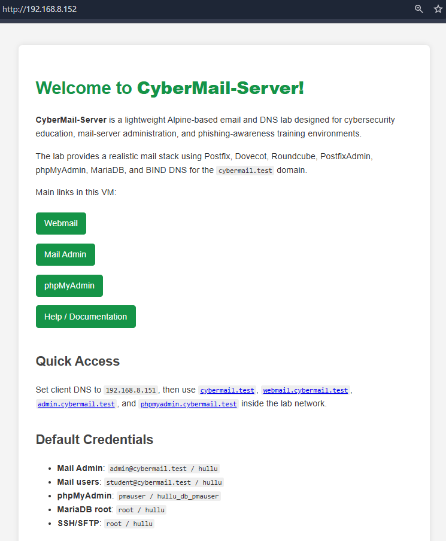

# CyberMail-Server

CyberMail-Server is a lightweight Alpine Linux virtual machine for cybersecurity education, email-server administration practice, and lab training scenarios. It includes a realistic mail stack with webmail, virtual mailbox administration, database administration, and local DNS support so you can practice email accounts, domains, aliases, SMTP, IMAP, MX records, and mail routing in an isolated environment.

Do not expose this VM as a real public mail server. Use it only in a private lab network.

## Screenshot



## Download

The CyberMail-Server OVA image is available from SourceForge:

https://sourceforge.net/projects/cybemail/files/

The VM is very lightweight, with an image size of less than 350 MB. It has been tested in VMware Workstation 26H1.

## Main VM Pages

Replace `<CyberMail-IP>` with the current VM address.

```text
CyberMail-Server home page: http://<CyberMail-IP>/
Webmail: http://<CyberMail-IP>/webmail/
Mail Admin: http://<CyberMail-IP>/admin/
phpMyAdmin: http://<CyberMail-IP>/phpmyadmin/
Help / Documentation: http://<CyberMail-IP>/help/
```

If a client machine is configured to use CyberMail-Server as its DNS server, the same pages can also be reached with:

```text
Home page: http://cybermail.test/
Webmail: http://webmail.cybermail.test/
Mail Admin: http://admin.cybermail.test/
phpMyAdmin: http://phpmyadmin.cybermail.test/
```

`mail.cybermail.test` is used as the mail host for MX, SMTP, and IMAP-related practice. It is not a web homepage.

Use the full `http://` address because some browsers may try HTTPS first or treat local lab names as search terms.

## Included Labs and Services

- Lighttpd web server for the CyberMail-Server home page and web interfaces
- Roundcube for browser-based webmail practice
- PostfixAdmin for mail domain, mailbox, and alias administration
- phpMyAdmin for database administration practice
- Postfix for SMTP mail sending and receiving
- Dovecot for IMAP mailbox access
- MariaDB/MySQL for virtual mail accounts and web application databases
- BIND 9 DNS server for the `cybermail.test` lab domain
- SSH for VM administration
- SFTP over SSH for encrypted file transfer

## Common Services and Ports

| Service | Protocol | Port | Default status | Purpose |
| --- | --- | --- | --- | --- |
| Lighttpd | HTTP | `80/tcp` | Started | Home page, Roundcube, PostfixAdmin, phpMyAdmin |
| SSH | SSH | `22/tcp` | Started | VM administration |
| SFTP | SFTP over SSH | `22/tcp` | Started with SSH | Encrypted VM file transfer |
| BIND | DNS | `53/tcp`, `53/udp` | Started | `cybermail.test` DNS resolution |
| Postfix | SMTP | `25/tcp` | Started | Mail transfer |
| Postfix Submission | SMTP AUTH | `587/tcp` | Started | Authenticated mail sending |
| Dovecot | IMAP | `143/tcp` | Started | Mailbox access |
| Dovecot | IMAPS | `993/tcp` | Started | Encrypted mailbox access if configured |
| PHP-FPM | FastCGI | `9000/tcp` on localhost | Started | PHP processing for web interfaces |
| MariaDB/MySQL | MySQL | local socket | Started | Mail and web interface databases |

Check open ports from Kali:

```sh
nmap -sV -p22,25,53,80,143,587,993 <CyberMail-IP>
```

## Webmail

Roundcube is the browser-based webmail interface included in CyberMail-Server.

Default access:

```text
http://<CyberMail-IP>/webmail/
http://webmail.cybermail.test/
```

Example webmail account:

```text
student@cybermail.test / hullu
```

Use Roundcube to send and receive local lab email messages, inspect message headers, and practice basic phishing-awareness and mail-flow scenarios.

## Mail Admin

PostfixAdmin is included for managing virtual mail domains, mailboxes, and aliases.

Default access:

```text
http://<CyberMail-IP>/admin/
http://admin.cybermail.test/
```

Default login:

```text
admin@cybermail.test / hullu
```

PostfixAdmin is focused on mail account administration. It does not manage all Postfix, Dovecot, DNS, firewall, or system service settings.

### Creating a New Mailbox

In PostfixAdmin, open:

```text
Virtual List -> Add Mailbox
```

For a mailbox such as `david@cybermail.test`:

- Enter `david` as the username
- Select `cybermail.test` as the domain
- Enter the password twice
- Optionally enter the full name and quota
- Leave `Active` enabled
- Click `Add Mailbox`

Default mailbox password requirements:

```text
Minimum length: 5 characters
Letters: at least 3
Digits: at least 2
```

Examples that pass:

```text
Password11!
Hullu2026!
Student99
```

`Password1!` does not pass because it contains only one digit.

## phpMyAdmin

phpMyAdmin is included for database administration practice.

Default access:

```text
http://<CyberMail-IP>/phpmyadmin/
http://phpmyadmin.cybermail.test/
```

Default login:

```text
pmauser / hullu_db_pmauser
```

MariaDB is intended for local VM use and is not exposed as a public network service by default.

## DNS

CyberMail-Server includes BIND 9 for the local `cybermail.test` lab domain. The DNS records are automatically updated to the current VM IP during boot.

Main DNS file:

```text
/etc/bind/zones/db.cybermail.test
```

Default lab records include:

```text
cybermail.test
mail.cybermail.test
webmail.cybermail.test
admin.cybermail.test
phpmyadmin.cybermail.test
```

`mail.cybermail.test` is included for email routing and mail-client configuration. Use `cybermail.test` for the home page and `webmail.cybermail.test` for Roundcube.

If a client machine uses CyberMail-Server as its DNS server, test the lab domain:

```sh
dig @<CyberMail-IP> cybermail.test A
dig @<CyberMail-IP> mail.cybermail.test A
dig @<CyberMail-IP> cybermail.test MX
```

CyberMail-Server forwards external DNS lookups to:

```text
8.8.8.8
1.1.1.1
```

For deeper DNS record editing practice, use a dedicated DNS lab VM such as [Hullu](https://github.com/kaledaljebur/hullu) and create or modify the `cybermail.test` zone there.

### Using Hullu or Another DNS Server

If you do not use CyberMail-Server as the DNS server, add a new `cybermail.test` zone to [Hullu](https://github.com/kaledaljebur/hullu) or to the external DNS server you are using. Do not add these records inside the existing `hullu.lab` zone.

Replace `<CyberMail-IP>` with the current CyberMail-Server address. Replace `<DNS-Server-IP>` with the IP address of Hullu or the external DNS server.

In Hullu DNS Lab, open `named.conf` and add this zone block:

```conf
zone "cybermail.test" IN {
    type master;
    file "/var/bind/pri/cybermail.test.zone";
};
```

Then create or edit this zone file on Hullu:

```text
/var/bind/pri/cybermail.test.zone
```

Use this zone content:

```zone
$TTL 1H
@       IN      SOA     ns1.cybermail.test. admin.cybermail.test. (
                        2026073001
                        1H
                        15M
                        1W
                        1H )

@           IN  NS      ns1.cybermail.test.
@           IN  MX      10 mail.cybermail.test.

@           IN  A       <CyberMail-IP>
ns1         IN  A       <DNS-Server-IP>
mail        IN  A       <CyberMail-IP>
webmail     IN  A       <CyberMail-IP>
admin       IN  A       <CyberMail-IP>
phpmyadmin  IN  A       <CyberMail-IP>
```

Minimum records needed for the web links and email routing:

```text
cybermail.test             A    <CyberMail-IP>
mail.cybermail.test        A    <CyberMail-IP>
webmail.cybermail.test     A    <CyberMail-IP>
admin.cybermail.test       A    <CyberMail-IP>
phpmyadmin.cybermail.test  A    <CyberMail-IP>
cybermail.test             MX   mail.cybermail.test
```

In Hullu DNS Lab, run:

```text
Check Config
Apply DNS
```

After applying DNS, set the client machine DNS server to Hullu or the external DNS server IP, then test:

```sh
dig @<DNS-Server-IP> webmail.cybermail.test A
dig @<DNS-Server-IP> admin.cybermail.test A
dig @<DNS-Server-IP> cybermail.test MX
```

## IP Configuration

Show the current IP address:

```sh
ip addr show eth0
ip route
```

Renew DHCP on Alpine Linux:

```sh
udhcpc -i eth0
```

Restart networking:

```sh
rc-service networking restart
```

To use DHCP persistently, `/etc/network/interfaces` should contain something like:

```text
auto eth0
iface eth0 inet dhcp
```

For a static IP, edit `/etc/network/interfaces`:

```text
auto eth0
iface eth0 inet static
    address 192.168.8.144
    netmask 255.255.255.0
    gateway 192.168.8.1
```

Then restart networking or reboot:

```sh
rc-service networking restart
```

After changing the VM IP, CyberMail-Server updates the console banner and `cybermail.test` DNS records automatically at boot. You can also run the updater manually:

```sh
/usr/local/sbin/update-cybermail-dns-ip
/usr/local/sbin/update-cybermail-banner
```

## SFTP Practice

SFTP is available through SSH on port `22`. It is different from SMTP, IMAP, and FTP, and it does not need a separate FTP service.

Use SFTP from Kali:

```sh
sftp root@<CyberMail-IP>
```

Copy a file to CyberMail-Server with SCP:

```sh
scp file.txt root@<CyberMail-IP>:/tmp/
```

Copy a file from CyberMail-Server to Kali:

```sh
scp root@<CyberMail-IP>:/etc/postfix/main.cf ./main.cf.copy
```

Use SFTP to discuss encrypted file transfer, SSH credentials, and safe handling of mail-server configuration files.

## Service Management

Check service status:

```sh
rc-service mariadb status
rc-service php-fpm84 status
rc-service lighttpd status
rc-service dovecot status
rc-service postfix status
rc-service named status
```

Start, stop, or restart a service:

```sh
rc-service postfix restart
rc-service dovecot restart
rc-service lighttpd restart
```

Enable services at boot:

```sh
rc-update add mariadb default
rc-update add php-fpm84 default
rc-update add lighttpd default
rc-update add dovecot default
rc-update add postfix default
rc-update add named default
```

CyberMail-Server also includes a local boot fallback to start the mail stack after networking is available:

```text
/etc/local.d/cybermail.start
```

## Practice Tasks

Use these tasks to practice how a real email server is managed inside a safe lab network.

- Open Roundcube and send an email between local users
- Create a new mailbox in PostfixAdmin
- Create an alias and test where the message is delivered
- Open a received email and inspect its headers
- Use `nmap` to identify SMTP and IMAP services
- Use `dig` to test DNS A and MX records
- Compare opening the server by IP address with opening it by DNS name
- Check how Postfix, Dovecot, Roundcube, PostfixAdmin, MariaDB, and BIND work together
- Use OpenRC to check, restart, stop, and start mail services

Example checks from Kali:

```sh
nmap -sV -p22,25,53,80,143,587,993 <CyberMail-IP>
dig @<CyberMail-IP> cybermail.test MX
dig @<CyberMail-IP> webmail.cybermail.test A
```

## Default Credentials

```text
VM console: root / hullu
SSH/SFTP: root / hullu
Mail Admin: admin@cybermail.test / hullu
Webmail example user: student@cybermail.test / hullu
phpMyAdmin: pmauser / hullu_db_pmauser
MariaDB root: root / hullu
```

## Notes

CyberMail-Server is designed for learning. Keep the VM in a NAT, host-only, or otherwise isolated lab network. Do not use it as a real internet mail server. Reset the VM state between classes or assessment runs when needed.

1 GB RAM is enough as a minimal VM size. Use 2 GB RAM if several people will access webmail, PostfixAdmin, and phpMyAdmin at the same time.

## Contact

Project: https://github.com/kaledaljebur/cybermail-server
